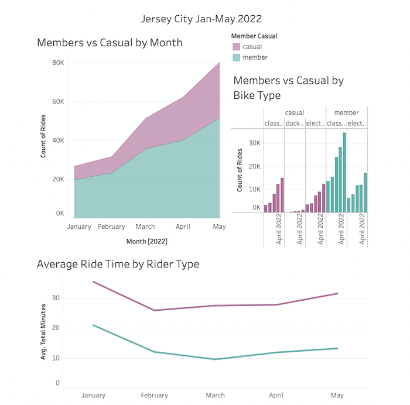
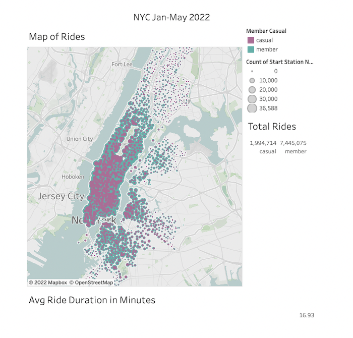

# Tableau-CitiBikes

Click to access my Tableau workbooks for [JC](https://public.tableau.com/app/profile/taylor.bohl/viz/CitiBikesJC/JerseyCityStory) and [NYC](https://public.tableau.com/app/profile/taylor.bohl/viz/CitiBikesNYC_16576320643570/NYCStory). Below are some screenshots of the dashboards I created along with my analysis report that is also in the last slide of each story.

If you wish to recreate my workbooks using the jupyter notebook files, please visit The CitiBike data page [here](https://s3.amazonaws.com/tripdata/index.html) and download the last 5 months of data for each city. 

## Report:
For this analysis I aggregated data found in the Citi Bike Trip History Logs to find two unexpected phenomena. I chose a data set between January 2022 and now, for both NYC and Jersey City. I combined several files in Pandas, and added a total trip duration column for my visualizations. Unfortunately the combined cities dataset caused some lag in Tableau, so I produced two workbooks, one for Jersey City and one for NYC that you can choose between in my profile. They compare the same elements and it’s interesting to see the differences between each city if you want to look at both.

I designed two dashboards with 3 visualizations for each discovered phenomenon (6 total each), then combined them ito a story for each city.

In the first dashboard, I explored how the ridership changes with the seasons as well as bike type and average ride time. I found it interesting that average ride time was higher for both rider types in the colder months. I attributed this to the fact that there are fewer riders in general during this time, and the folks who are riding in less than ideal weather are dedicated bikers who tend to travel everywhere by bike, including longer distances.

In the second dashboard, a map is displayed that shows concentration of station use by the size of the marker as well as Member vs Casual counts. If you click on a marker, the Total Rides and Average Ride time will update based on that station. I wasn’t expecting to find such a difference in rider type based on area/neighborhood. In Jersey City, there are far more causal riders on the north side, and on the south side more members are using the program. In NYC, there are many casual riders that start near Central Park, but the rest of the city is pretty evenly distributed between rider type.

